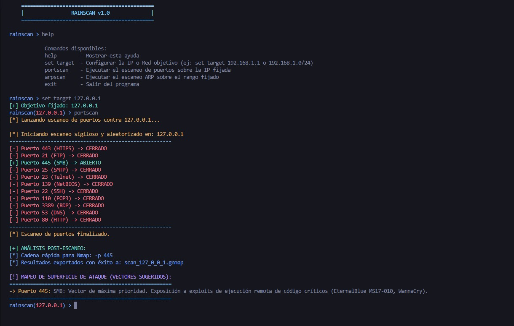
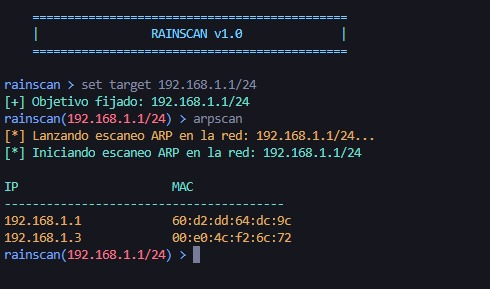

# RainScan v1.0 🚀

**RainScan** es un framework modular e interactivo de auditoría de redes y reconocimiento desarrollado en Python. Diseñado con una interfaz de consola interactiva inspirada en herramientas de explotación profesional, permite realizar descubrimientos locales y análisis de superficies de ataque de manera eficiente y centralizada.

---

## ✨ Características Principales

- **Consola Interactiva Dinámica:** Prompt interactivo a color (utilizando colorama) que cambia en tiempo real según el objetivo fijado.
- **Módulo ARP Scan:** Descubrimiento rápido de hosts activos y sus respectivas direcciones MAC dentro de un segmento de red local (Capa 2) utilizando Scapy.
- **Módulo Port Scan Elusivo:** Escaneo de puertos críticos y vulnerables comunes (21, 22, 23, 80, 443, 445, etc.) optimizado con técnicas de evasión:
  - Aleatorización: Mezcla el orden de los puertos para romper patrones secuenciales detectables por sistemas IDS.
  - Delays: Introduce retrasos de tiempo aleatorios entre conexiones para imitar el tráfico humano.
- **Inteligencia de Amenazas:** Mapeo automatizado de vectores de ataque potenciales y exploits históricos (como EternalBlue/WannaCry) según los puertos detectados abiertos.
- **Interoperabilidad:** Exportación automática de resultados a formato grepable (.gnmap) y generación de cadenas de comando optimizadas listas para copiar y pegar directamente en Nmap.

---

## 🛠️ Requisitos e Instalación

### Prerrequisitos
El script requiere Python 3.x y las siguientes librerías de dependencias:

pip install colorama scapy

Nota para entornos Windows: Para la inyección y captura de paquetes en Capa 2 (ARP Scan), es necesario tener instalado Npcap en modo de compatibilidad con la API de WinPcap. En entornos Linux (Kali/Arch), se requiere ejecutar el script principal con privilegios de superusuario (sudo).

---

## 🚀 Modo de Uso

1. Ejecuta el archivo principal para iniciar el framework:
   python main.py

2. Configura tu objetivo (puede ser una IP individual para escaneo de puertos o un segmento CIDR para el escaneo ARP):
   rainscan > set target 192.168.1.1
   [+] Objetivo fijado: 192.168.1.1

3. Ejecuta los módulos disponibles:
   rainscan (192.168.1.1) > portscan
   rainscan (192.168.1.0/24) > arpscan

4. Escribe help en cualquier momento para ver la lista completa de comandos de la consola.

---

## 📝 Capturas de Pantalla

### Resultados del Escaneo de Puertos y Vectores de Ataque

### Escaneo ARP

---

## ⚠️ Descargo de Responsabilidad (Disclaimer)

Esta herramienta ha sido desarrollada exclusivamente con fines educativos, de investigación académica y para la realización de auditorías de seguridad debidamente autorizadas (Hacking Ético). El uso de este software contra objetivos sin el consentimiento previo y por escrito es completamente ilegal. El desarrollador no se hace responsable del mal uso o de los daños causados por esta herramienta.
